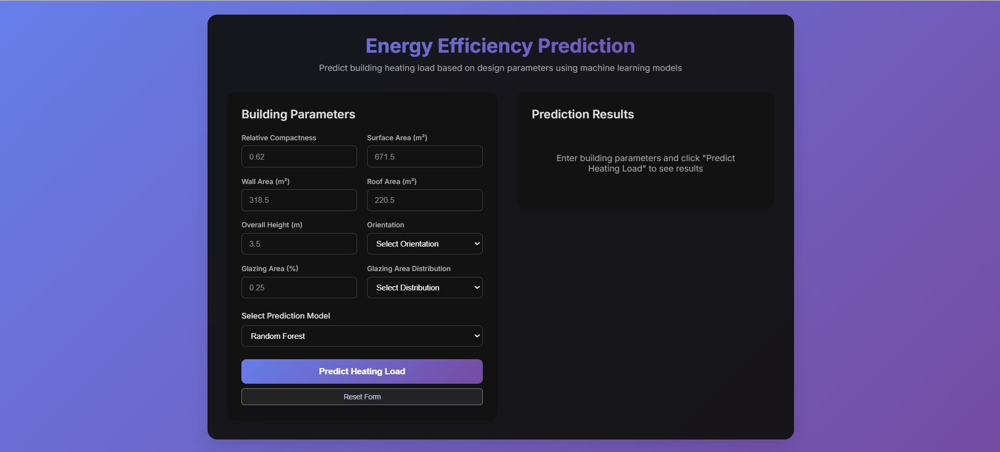

# 🏢 Smart Building Energy ML

<div align="center">
  
</div>

A modern web application for predicting building heating load using machine learning models. Built with React (Vite.js) frontend and Flask backend, featuring three trained ML models: Linear Regression, Decision Tree, and Random Forest.

<div align="center">


</div>

## 🌟 Features

- **🎯 Multiple ML Models**: Compare predictions from Linear Regression, Decision Tree, and Random Forest
- **📱 Responsive Design**: Modern glassmorphism UI that works on desktop and mobile
- **⚡ Real-time Predictions**: Instant heating load predictions based on building parameters
- **🔄 Interactive Forms**: User-friendly form with validation and error handling
- **📊 Professional Results**: Clear visualization of prediction results with model information
- **🚀 Fast & Efficient**: Built with Vite.js for lightning-fast development and production builds

## 🏗️ Architecture

```
smart-building-energy-ml/
├── 📁 backend/                 # Flask API Server
│   ├── app.py                 # Main Flask application
│   ├── models/                # Pre-trained ML models
│   │   ├── linear_regression.joblib
│   │   ├── decision_tree.joblib
│   │   └── random_forest.joblib
│   └── requirements.txt       # Python dependencies
├── 📁 frontend/               # React Frontend
│   ├── src/
│   │   ├── App.jsx           # Main App component
│   │   ├── main.jsx          # React entry point
│   │   ├── index.css         # Global styles
│   │   └── components/
│   │       └── PredictionForm.jsx
│   ├── index.html
│   ├── package.json
│   └── vite.config.js
└── README.md
```

## 🔧 Tech Stack

### Frontend
- **React 18.2.0** - Modern UI library
- **Vite.js** - Fast build tool and development server
- **Axios** - HTTP client for API requests
- **CSS3** - Custom styling with gradients and animations

### Backend
- **Flask 2.3.3** - Lightweight Python web framework
- **scikit-learn** - Machine learning models
- **joblib** - Model serialization
- **Flask-CORS** - Cross-origin resource sharing
- **NumPy** - Numerical computing

## 🚀 Quick Start

### Prerequisites
- Python 3.8 or higher
- Node.js 16 or higher
- npm or yarn

### 1️⃣ Clone the Repository
```bash
git clone https://github.com/DevPatel2020/smart-building-energy-ml.git
cd smart-building-energy-ml
```

### 2️⃣ Backend Setup
cd backend
pip install -r requirements.txt

# If you get any module-related errors:
pip install flask flask-cors joblib numpy
pip install scikit-learn

# Run the backend
python app.py

⚠️ Python Version Advisory

It is recommended to use Python 3.11.3, because the version of numpy used (1.24.3) is not compatible with Python 3.12.3 and later.
If you encounter errors like numpy.core.multiarray failed to import, it's likely due to this version mismatch.

🔗 Once running, your backend will be available at:

http://localhost:5000


### 3️⃣ Frontend Setup
```bash
cd frontend

# Install dependencies
npm install

# Start the development server
npm run dev
```
The frontend will run on `http://localhost:3000`

### 4️⃣ Access the Application
Open your browser and navigate to `http://localhost:3000`

## 📊 Building Parameters

The application predicts heating load based on these building design parameters:

| Parameter | Description | Range/Options |
|-----------|-------------|---------------|
| **Relative Compactness** | Building shape efficiency | 0.0 - 1.0 |
| **Surface Area** | Total building surface area | > 0 m² |
| **Wall Area** | Total wall area | > 0 m² |
| **Roof Area** | Total roof area | > 0 m² |
| **Overall Height** | Building height | > 0 m |
| **Orientation** | Building orientation | North(2), East(3), South(4), West(5) |
| **Glazing Area** | Window area percentage | 0.0 - 1.0 |
| **Glazing Distribution** | Window distribution pattern | Uniform(0), North(1), East(2), South(3), West(4), North&East(5) |

## 🤖 Machine Learning Models

### 1. Linear Regression
- **Type**: Linear model
- **Use Case**: Baseline predictions and interpretability
- **Pros**: Fast, interpretable, good for linear relationships

### 2. Decision Tree
- **Type**: Tree-based model
- **Use Case**: Non-linear patterns and feature importance
- **Pros**: Interpretable, handles non-linear relationships

### 3. Random Forest
- **Type**: Ensemble model
- **Use Case**: Robust predictions with high accuracy
- **Pros**: Reduces overfitting, handles complex patterns

## 🔌 API Endpoints

| Endpoint | Method | Description |
|----------|--------|-------------|
| `/` | GET | API status and available models |
| `/predict` | POST | Make heating load predictions |
| `/models` | GET | List available ML models |
| `/health` | GET | Health check endpoint |

### Sample API Request
```json
POST /predict
{
  "relative_compactness": 0.79,
  "surface_area": 671.5,
  "wall_area": 318.5,
  "roof_area": 220.5,
  "overall_height": 3.5,
  "orientation": 4,
  "glazing_area": 0.25,
  "glazing_area_distribution": 3,
  "model": "random_forest"
}
```

### Sample API Response
```json
{
  "heating_load_prediction": 22.45,
  "model_used": "random_forest",
  "input_features": {
    "relative_compactness": 0.79,
    "surface_area": 671.5,
    // ... other features
  }
}
```

## 🎨 UI/UX Features

- **Modern Design**: Glassmorphism effects with gradient backgrounds
- **Responsive Layout**: Works perfectly on desktop, tablet, and mobile
- **Form Validation**: Real-time input validation with helpful error messages
- **Loading States**: Visual feedback during prediction processing
- **Accessibility**: Proper labels, focus states, and semantic HTML
- **Professional Typography**: Inter font family for clean, modern look

## 🛠️ Development

### Running in Development Mode
```bash
# Backend (Flask with debug=True)
cd backend
python app.py

# Frontend (Vite dev server with hot reload)
cd frontend
npm run dev
```

### Building for Production
```bash
# Frontend production build
cd frontend
npm run build

# The built files will be in the dist/ directory
```

## 📈 Performance Metrics

The models were trained and evaluated using:
- **MAE** (Mean Absolute Error)
- **RMSE** (Root Mean Square Error)  
- **R²** (R-squared Score)

## 🤝 Contributing

1. Fork the repository
2. Create your feature branch (`git checkout -b feature/AmazingFeature`)
3. Commit your changes (`git commit -m 'Add some AmazingFeature'`)
4. Push to the branch (`git push origin feature/AmazingFeature`)
5. Open a Pull Request

## 📝 License

This project is licensed under the MIT License - see the [LICENSE](LICENSE) file for details.

## 🏆 Acknowledgments

- Energy Efficiency Dataset from UCI Machine Learning Repository(https://archive.ics.uci.edu/dataset/242/energy+efficiency)
- Built with modern web technologies for optimal performance
- Inspired by sustainable building design principles

## 📞 Contact

**Project Maintainer**: Dev Patel
- GitHub: [@DevPatel2020](https://github.com/DevPatel2020)
- Email: devpatel93131@gmail.com

---

⭐ **Star this repository if you find it helpful!**

## 🔄 Recent Updates

- ✅ Added responsive design for mobile devices
- ✅ Implemented error handling and loading states
- ✅ Enhanced UI with glassmorphism effects
- ✅ Added model comparison functionality
- ✅ Improved form validation and user experience

---

**Built with ❤️ for sustainable building design**
